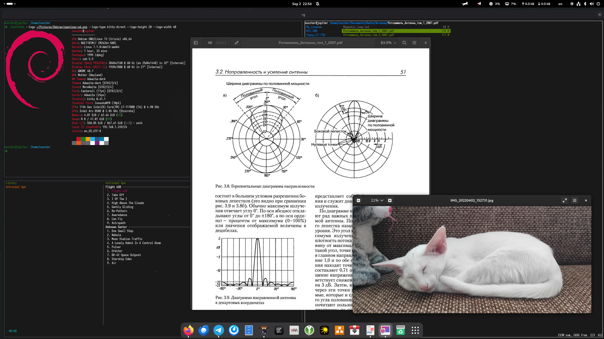
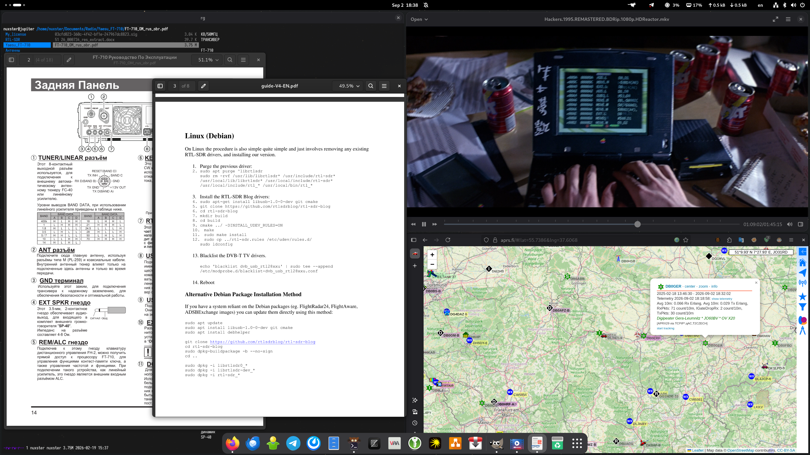
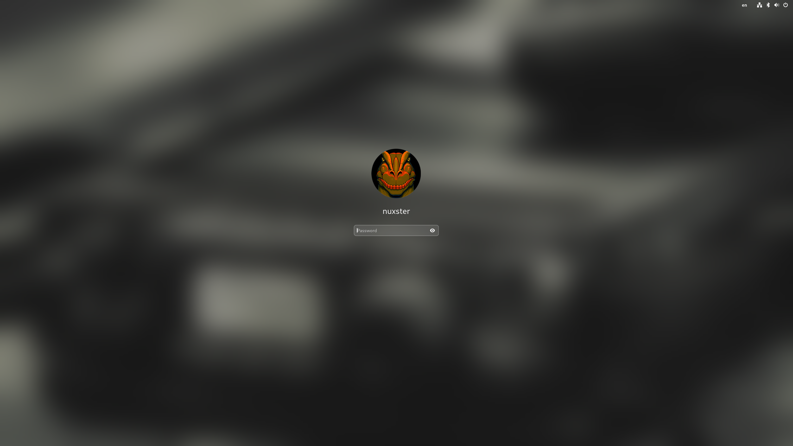

# My Debian Workstation IaC







# Debian installation
1. To install use the latest build of Debian stable (now Debian 13) [link](https://cdimage.debian.org/cdimage/release/current/amd64/iso-cd/);
2. Perform a minimal installation, uncheck all components;

# Prepare 
```shell
sudo apt update
git clone https://github.com/nuxster/my-debian-workstation-iac.git
cd my-debian-workstation-iac
```

# Configure
First, you need to initialize a number of variables in the `ansible/group_vars/all.yml` file with the values that are relevant to you.

| Variable | Default | Description |
|---|---|---|
| `CPU` | `intel` | CPU manufacturer (`intel` or `amd`), used to select the microcode package |
| `SSD_DEVICES` | `true` | There is an SSD in the system: enables fstrim.timer and SSD-friendly sysctl parameters |
| `DESTINATION_DEVICE` | `desktop` | Target device type: `desktop`, `laptop` or `vm` |
| `USERNAME` | user running the playbook | The name of your user in the system |
| `USER_HOME` | `/home/{{ USERNAME }}` | The user home directory |
| `TIMEZONE` | `Europe/Moscow` | User's timezone |
| `DEFAULT_TEXT_EDITOR_PACKAGE` | `neovim` | The default text editor package |
| `LOCALE` | `en_US.UTF-8` | System locale (must be an UTF-8 locale, e.g. `en_US.UTF-8` or `ru_RU.UTF-8`) |
| `INPUT_SOURCES` | `[us, ru]` | XKB keyboard layouts available in Gnome (the first one is the default) |
| `OFFICE` | `false` | Install Libre Office and spelling packages |
| `PRINTING` | `false` | Install printing (CUPS) packages |
| `HYPERVISOR` | `false` | Install hypervisor (QEMU/Libvirt) packages |
| `UPGRADE_PACKAGES` | `true` | Upgrade all packages during the run |
| `NTP_DAEMON` | `true` | Install ntp daemon (chrony) |
| `APT_SOURCE_MIRROR_URL` | `deb.debian.org` | APT mirror (uncomment to override, e.g. `mirror.yandex.ru`) |
| `APT_SOURCE_SECURITY_MIRROR_URL` | `security.debian.org` | APT security mirror (uncomment to override) |
| `DEBIAN_RELEASE` | codename of the installed release | Debian release used in sources.list: a codename (`trixie`), `stable` or `unstable` (uncomment to override) |
| `RECONFIGURE_NETWORK` | `true` | Rewrite `/etc/network/interfaces` so that NetworkManager manages all interfaces |
| `GDM_AUTOLOGIN` | `true` | Enable GDM autologin (see the note below) |
| `TMP_DIRECTORY` | `/tmp` | Directory for temporary files (downloads, cloned themes) |

# Run installation
The script will install the necessary packages and everything that is required to run Ansible.
```shell
./run.sh --tags common,desktop_environment,localization
```

**Reboot the system after the run is finished** — the Gnome session, NetworkManager control over the network interfaces and the new kernel parameters take effect after reboot:
```shell
sudo reboot
```

# Notes

### GDM autologin
The system is expected to be installed on an encrypted disk (LUKS). The LUKS passphrase is asked at boot, so GDM autologin is enabled by default to avoid entering a password twice. Set `GDM_AUTOLOGIN: false` if the disk is not encrypted. `sudo` always asks for the user password.

### Power management on laptops
On laptops TLP is used for power management. TLP conflicts with `power-profiles-daemon`, so the latter is removed and the power profiles selector in Gnome Settings is not available. TLP is configured via `/etc/tlp.d/01-mytlp.conf`.

# Interesting additional extensions

- RunCat (https://github.com/win0err/gnome-runcat)
```shell
wget https://github.com/win0err/gnome-runcat/releases/download/v31/runcat@kolesnikov.se.shell-extension.zip
gnome-extensions install  runcat@kolesnikov.se.shell-extension.zip --force
gnome-extensions enable runcat@kolesnikov.se
```

# Ranger
```shell
ranger --copy-config=all
vim ~/.config/ranger/rc.conf

#!!! Using the preview is unsafe because the images are copied to /tmp. !!!
set preview_script ~/.config/ranger/scope.sh
set colorscheme solarized

# To preview images, add the following lines to ranger configuration file
# and install python module 'pillow':
set preview_images true
set preview_images_method kitty

sudo apt install python3-pil

# Set a program that opens files of a certain type
vim ~/.config/ranger/rifle.conf 

# Example for video files
mime ^video,       has celluloid, X, flag f = celluloid -- "$@"
```
